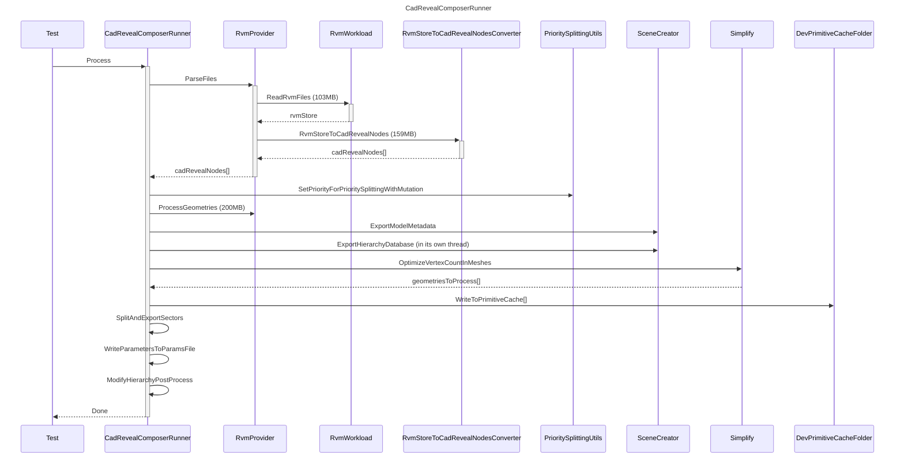

# Architecture Overview

## CadRevealComposerRunner

```mermaid

sequenceDiagram
title CadRevealComposerRunner

participant Test
participant CadRevealComposerRunner
participant RvmProvider
participant RvmWorkload
participant RvmStoreToCadRevealNodesConverter
participant PrioritySplittingUtils

Test->>+CadRevealComposerRunner:Process
CadRevealComposerRunner->>+RvmProvider:ParseFiles
RvmProvider->>+RvmWorkload:ReadRvmFiles (103MB)
RvmWorkload-->>-RvmProvider:rvmStore
RvmProvider->>+RvmStoreToCadRevealNodesConverter:RvmStoreToCadRevealNodes (159MB)
RvmStoreToCadRevealNodesConverter-->>-RvmProvider:cadRevealNodes[]
RvmProvider-->>-CadRevealComposerRunner:cadRevealNodes[]
CadRevealComposerRunner->>PrioritySplittingUtils:SetPriorityForPrioritySplittingWithMutation
CadRevealComposerRunner->>RvmProvider:ProcessGeometries (200MB)

CadRevealComposerRunner->>SceneCreator:ExportModelMetadata
CadRevealComposerRunner->>SceneCreator:ExportHierarchyDatabase (in its own thread)

CadRevealComposerRunner->>Simplify:OptimizeVertexCountInMeshes
Simplify-->>CadRevealComposerRunner:geometriesToProcess[]

CadRevealComposerRunner->>DevPrimitiveCacheFolder:WriteToPrimitiveCache[]

CadRevealComposerRunner->>CadRevealComposerRunner:SplitAndExportSectors

CadRevealComposerRunner->>CadRevealComposerRunner:WriteParametersToParamsFile
CadRevealComposerRunner->>CadRevealComposerRunner:ModifyHierarchyPostProcess

CadRevealComposerRunner-->>-Test:Done
```
