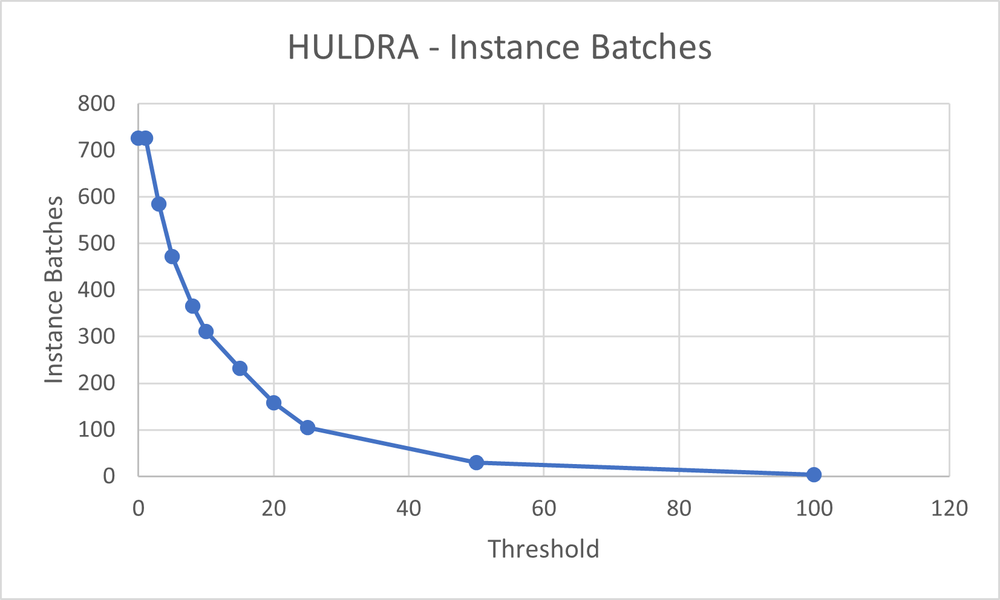

# Convert InstanceMeshes when too few in a sector

## [Reference branch](https://github.com/equinor/rvmsharp/tree/Spike/ConvertInstanceMeshesWhenTooFew)

## Goal

Try to avoid using instance meshes where there are too few occuring internally in a sector. This will hopefully have a positive effect on the performance.

This is a balancing act between having too many instances (too many batches) and too few instances (too much memory).

## Method

During splitting, just before the sector is completed, the number of instances per instance id is checked. If the number is lower than a set threshold, convert them to triangle meshes instead. The threshold is currently just an arbitrary set number.

The number of extra triangles created is counted while splitting into sectors. The number is equal to the triangle count of the instance template times number of instance meshes which is converted to triangle meshes. Remember that converting the template does not increase the number of triangles.

Counting the number of batches is a bit less robust. By printing when the should batch flag is set, the number of prints in displayed in the console. Even if the number is not accurate, the trend is quite visible and if you stay at the same place in the model you will get the same result every time (if the size of your window is the same).

## Evidence

### Huldra

[Link to position in asset](https://localhost:3000/echo3d?instCode=TROA&plantCode=tof&platformSectionId=Full-Asb&cadViewState=eyJwb3NYIjo5OS4yNzYyNTQ5ODY5MTcxNywicG9zWSI6NjcuNDI4MTMxNjQwMTY5OTIsInBvc1oiOi0yMzkuODA0MTk1ODI5NjkxNTQsImlzT3JiaXQiOmZhbHNlLCJ0YXJnZXRQb3NYIjotMC41MjM1OTg4NDcyMTgwNzE4LCJ0YXJnZXRQb3NZIjowLCJ0YXJnZXRQb3NaIjowLCJ0aW1lc3RhbXAiOjE2ODUwMTUyMTM3NTgsInZlcnNpb24iOjF9)

| Threshold | Extra triangles | Primitive batches | Instance batches | Sectors|
|-----------|-----------------|-------------------|------------------|--------|
|0|0|434|726|61|
|1|0|434|726|61|
|3|3852|434|585|60|
|5|17540|434|472|60|
|8|32848|434|366|60|
|10|48356|434|311|60|
|15|76690|434|232|60|
|20|113682|434|158|60|
|25|149610|434|105|60|
|50|218428|434|29|60|
|100|277936|434|4|60|

### ASGB

[Link to position in asset](https://localhost:3000/echo3d?instCode=TROA&plantCode=tof&platformSectionId=Full-Asb&cadViewState=eyJwb3NYIjozMDUuMzIzMDI4ODEwODA3NTYsInBvc1kiOjk1LjA5Mzg4NDYwNDczMTksInBvc1oiOi00MDQuOTA0MTQyMzU1MTQ0MSwiaXNPcmJpdCI6ZmFsc2UsInRhcmdldFBvc1giOi0wLjUyMzU5ODc2MDU0MzcxNjMsInRhcmdldFBvc1kiOjAsInRhcmdldFBvc1oiOjAsInRpbWVzdGFtcCI6MTY4NTAyMDg4ODM4NSwidmVyc2lvbiI6MX0%3D
)

| Threshold | Extra triangles | Primitive batches | Instance batches | Sectors|
|-----------|-----------------|-------------------|------------------|--------|
|0|0|1050|5035|165|
|1|0|1050|5035|165|
|3|110900|1050|3546|164|
|5|431448|1050|2589|164|
|8|849312|1050|1754|164|
|10|1107316|1050|1400|164|
|15|1528252|1050|904|164|
|20|1828444|1050|652|164|
|25|2026788|1050|490|163|
|50|2572272|1050|169|163|
|100|2909564|1050|47|163|

## Conclusion

## Next steps

Find a threshold that makes sense.
