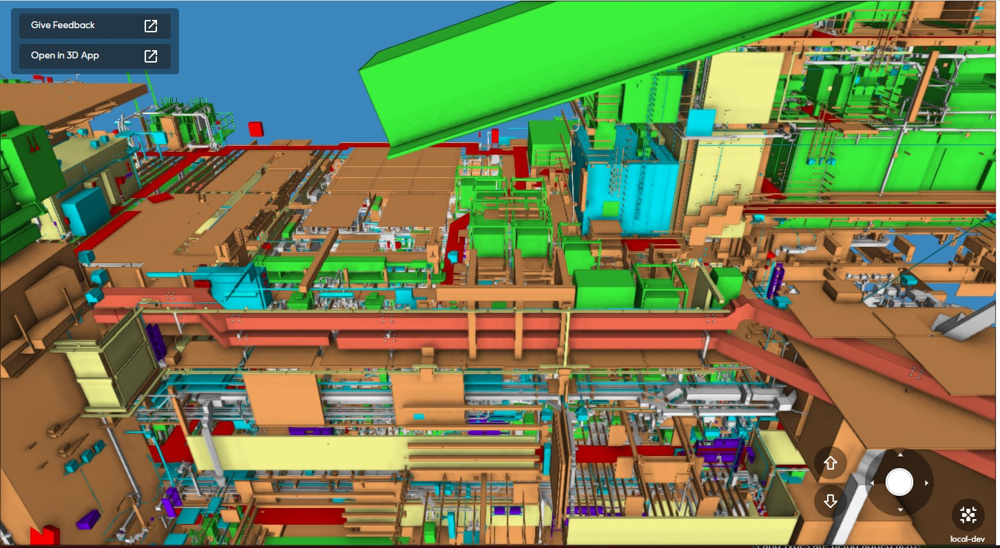
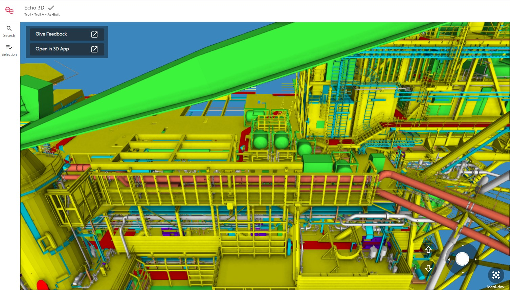
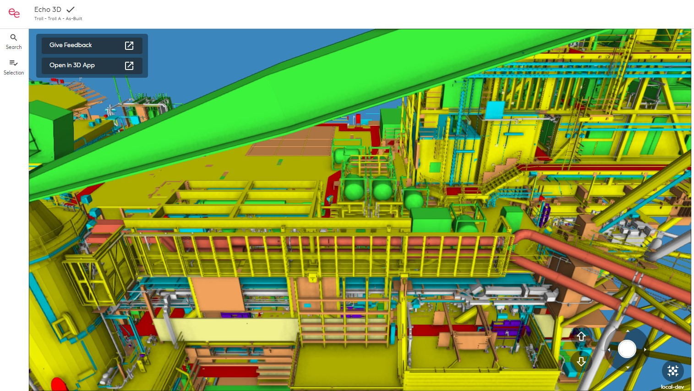

# Spike: Shadow Low Poly Sectors

## Trace back references

### Conducted by: Anders E Aabakken

### Backlog Work Item: {Link to the work item to provide more context}

### Sprint: {Which sprint did the study take place. Include sprint start date}

## NOTE:
This spike has already been followed up by related spikes & stories that has brought this work further.  Keeping document for backtracking references.

## Goal

Describe what question(s) the spike intends to answer and why.

We want to investigate whether it is possible to create a low quality "shadow" copy of the sectors for an asset and serving this copy rather than the full resolution sector when appropriate.  This could open for loading of assets with dynamic level of details (aka LOD) based on a set of criteria.

This spike covers the possibility to create such sectors. It is out of scope of this spike to identify the client side rules and/or ways of deciding what LOD to load at any given time.

## Method

The idea is that creating a shadow sector for the actual sectors should be possible during at the same time as the decision on what sector to add each node to during the building of an asset.

The spike replace nodes with a Box covering the bounding box of the node, rather than the actual object(s) rendered in the "real" sector.

NOTE: In order to allow for selection and highlighting to be carried through a change in LOD, the tree indexes must match across the various LOD-levels

## Evidence

Document the evidence collected that informed the conclusions below. Examples may include:

Recorded or live demos of a prototype providing the desired capabilities
Metrics collected while testing the prototype
Documentation that indicates the solution can provided the desired capabilities

The trials has been run on multiple assets, creating an overall impression on what is possible. A simplified version of a possible client side selection of sectors was used alongside to visualize the results.  Please find attached sample images and short animations.

Only boxed shadow sectors loaded:

Only real sectors loaded:

Real sectors loaded for <20 meters, otherwise shadow:

Selections kept across change of LOD:

## Conclusions

What was the answer to the question(s) outlined at the start of the spike? Capture what was learned that will inform future work.

The conclusion is that it is indeed possible to create some sort of LOD system based on the knowledge we have at hand during the creation of an asset.

## Next Steps

What work is expected as an outcome of the learning within this spike. Was there work that was blocked or dependent on the learning within this spike?

The spike does NOT take into consideration the increased amount of memory required in order to generate the shadow sectors.  There are multiple ways of doing the actual implementation, some might increase memory consumption, others are likely to demand more processing power. (and thus longer crunch time)
