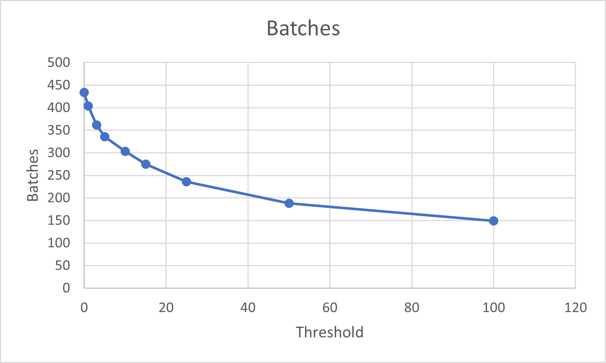

# Convert primitives when too few in a sector

## [Reference branch](https://github.com/equinor/rvmsharp/tree/Spike/ConvertPrimitivesWhenTooFew)

## Goal

Try to limit the number of primitive batches by not creating batches when there are too few primitives.

This is a balancing act between having too many batches and requiring too much memory.

## Method

During splitting the number of each type of primitive is counted and compared with a set threshold. If the number is below the threshold the primitive is switched out with a trianglemesh.

## Evidence

|Threshold|Batches|
|---------|-------|
|0|434|
|1|404|
|3|361|
|5|336|
|10|303|
|15|275|
|25|236|
|50|188|
|100|149|

### Huldra

[Link to position in asset](https://localhost:3000/echo3d?instCode=TROA&plantCode=tof&platformSectionId=Full-Asb&cadViewState=eyJwb3NYIjo5OS4yNzYyNTQ5ODY5MTcxNywicG9zWSI6NjcuNDI4MTMxNjQwMTY5OTIsInBvc1oiOi0yMzkuODA0MTk1ODI5NjkxNTQsImlzT3JiaXQiOmZhbHNlLCJ0YXJnZXRQb3NYIjotMC41MjM1OTg4NDcyMTgwNzE4LCJ0YXJnZXRQb3NZIjowLCJ0YXJnZXRQb3NaIjowLCJ0aW1lc3RhbXAiOjE2ODUwMTUyMTM3NTgsInZlcnNpb24iOjF9)

## Conclusion

The graph produced indicates that we can save some batches, even by setting the threshold reasonably low.

## Next steps

- Find a threshold that is satisfactory
- Are some types of primitives costlier to mesh out than others?