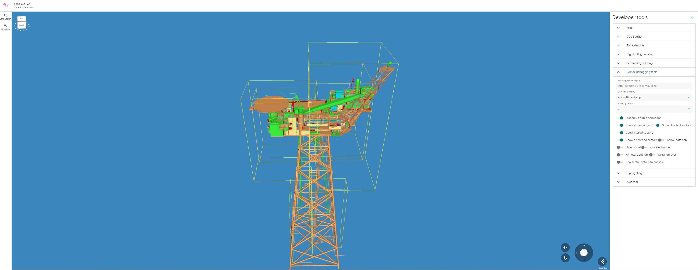
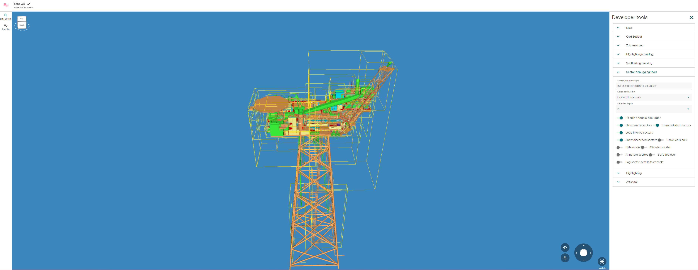

# Sector split on area

## [Reference branch](https://github.com/equinor/rvmsharp/tree/Spike/AreasAsSector)

## Goal

Split sectors on the area code to enhance user experience by presenting more relevant parts at any given time. As a bonus we might achieve more floor aligned sectors, which also might enhance user experience. Splitting on area has been implemented before, but we have no data on why it was decided not to be merged.

## Method

Start by grouping the nodes on the area of the first geometry for each node. Then loop over each group and split the sectors recursively. Make a build on Huldra and document the findings. This is a naive split for each area as if it was a root sector (depth = 1). There might be possible better methods, which are not investigated in this spike.

## Results

### Table of sector counts on Huldra

| Huldra        | Sector count |
| -----------   | ------------ |
| Master        | 189          |
| SplitOnArea   | 359          |

#### Huldra on master

#### Huldra on Spike/AreasAsSplit

There are over double the amount of sectors and the sectors are overlapping in Huldra. Additionally, the percieved performance was worse.

Melkøya and Johan Sverdrup was also investigated.

A common theme for all plants is that some areas have outlier geometries, resulting in large bounding boxes.

## Conclusion

This improvements in user experience is negative or best case not satisfactory, and should not be included.

## Next steps

- Find a solution to manage the outliers in the areas to reduce the size of the bounding boxes.
- Test if there are benefits in making the area root sector (depth = 1) cubed
