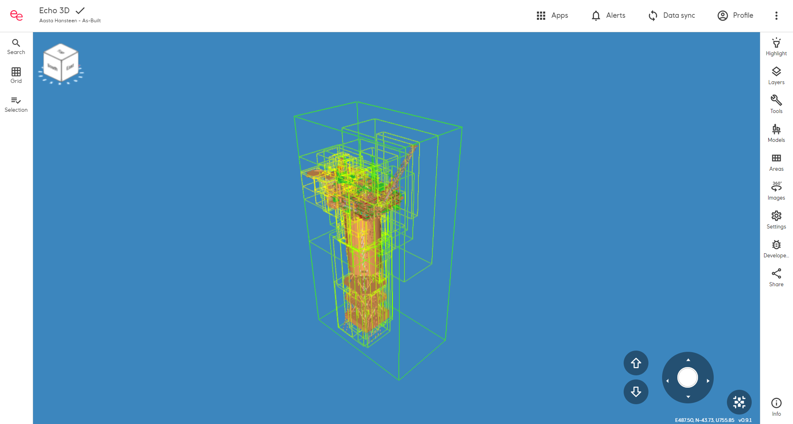
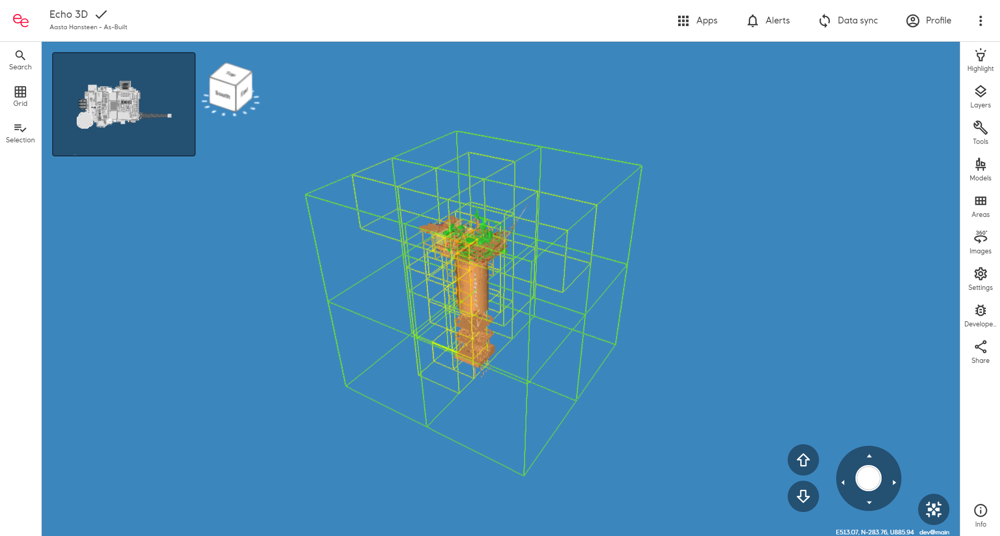
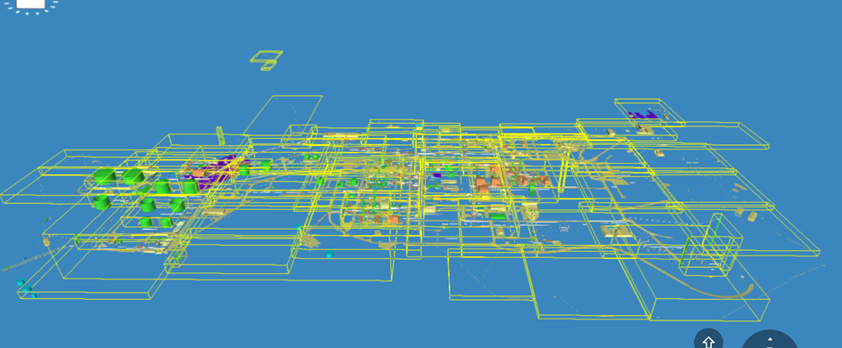
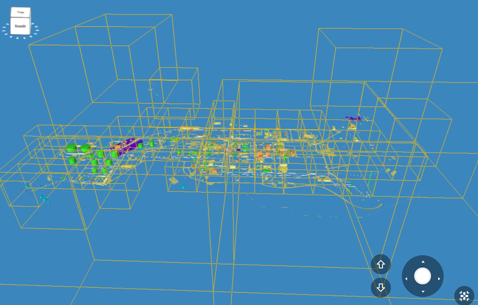
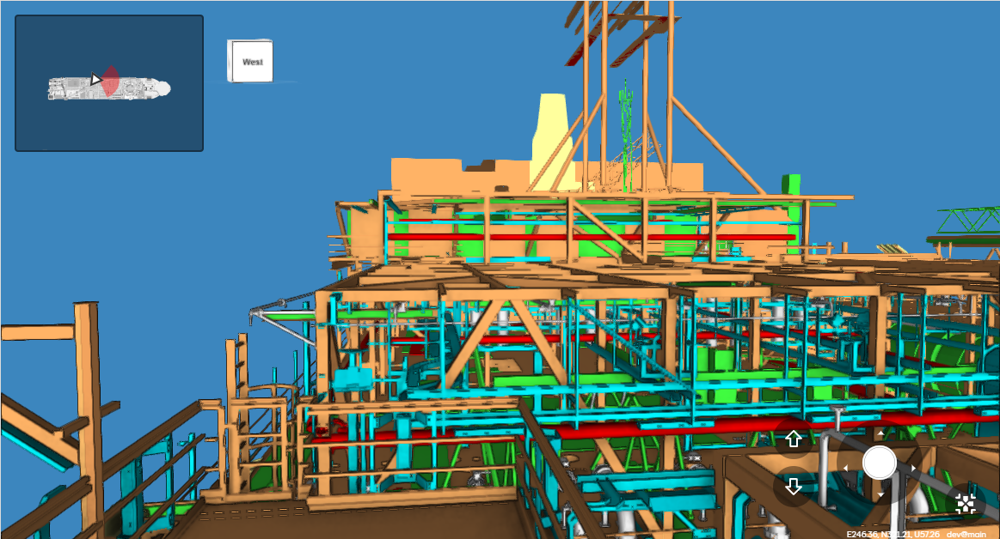
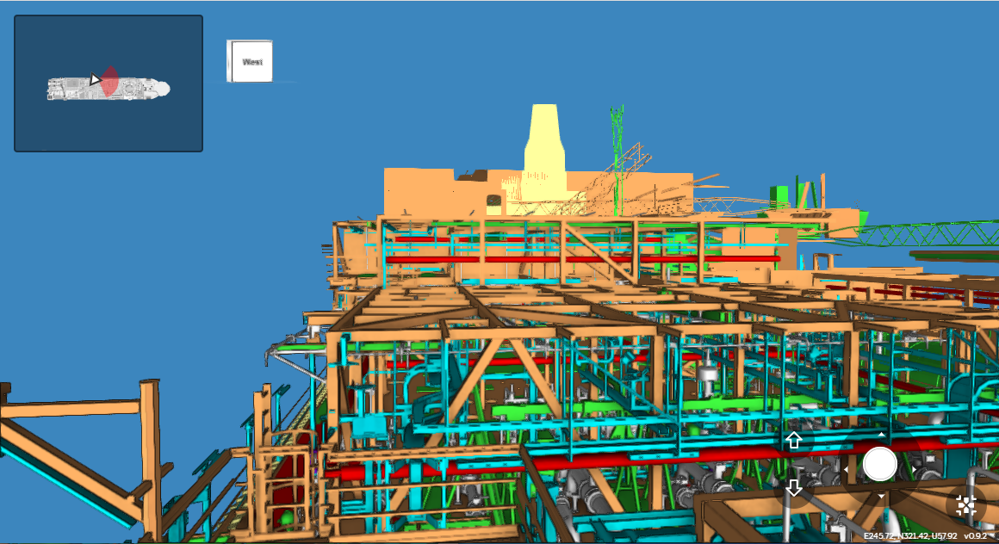
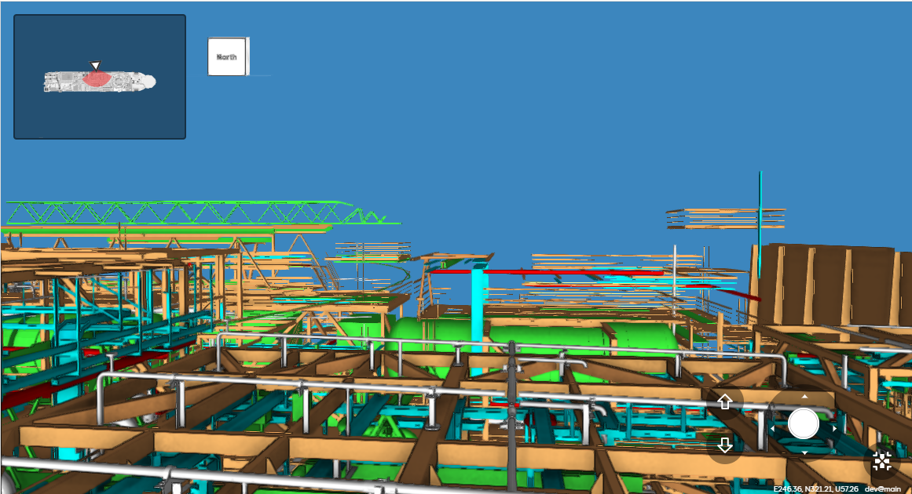
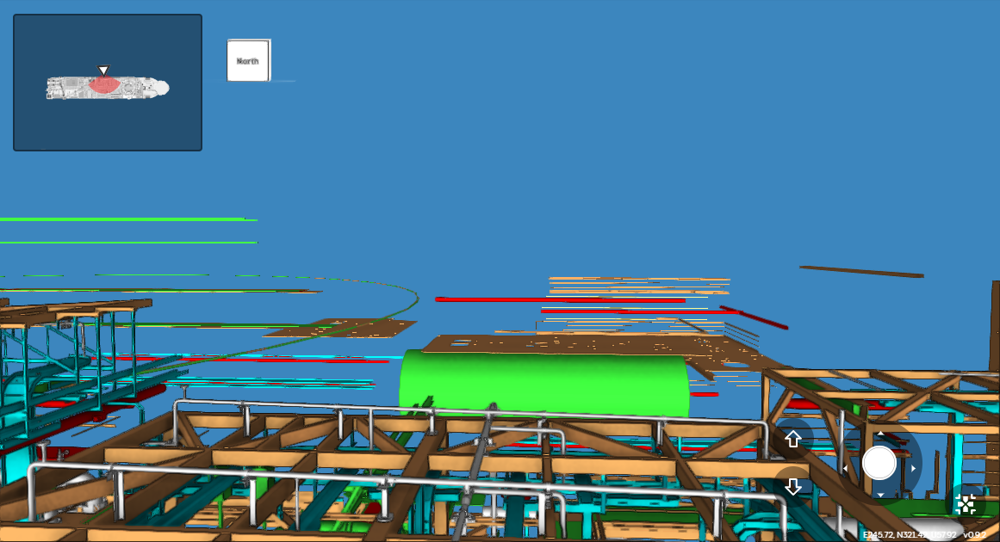
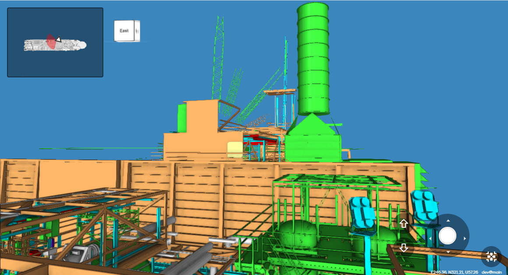
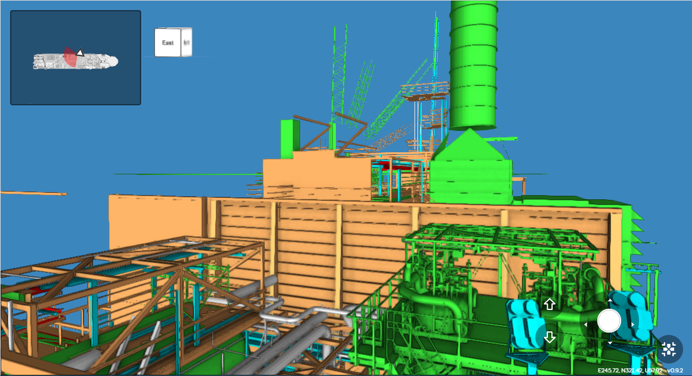

# Keep the octree shape when sector splitting

## [Reference branch](https://github.com/equinor/rvmsharp/commits/Spike/KeepOctreeShape)

## Goal

Try to keep the octree shape when sector splitting instead of making tighter bounding sectors.
This is done to avoid making unfavorable sector shapes such as oblong sectors.

Oblong sectors are a problem if a user stands at the edge of sector and is looking away from the centre, because a lot of parts behind her would still be rendered.

## Method

Calculate the bounding box encapsulating all nodes as usual for depth 1. Make this bounding box cubed (which we call cubify) by increasing/decreasing the x, y, and z values based on the largest value.

For instance:

Bounding box data:

- $X_{min}$ = 1, &emsp; $X_{max}$ = 3
- $Y_{min}$ = 4, &emsp; $Y_{max}$ = 8
- $Z_{min}$ = 0, &emsp; $Z_{max}$ = 6

Implies cubed bounding box data:

- $X_{min}$ = -1, &emsp; $X_{max}$ = 5
- $Y_{min}$ = 2,  &emsp; $Y_{max}$ = 6
- $Z_{min}$ = 0,  &emsp; $Z_{max}$ = 6

This cubic box is then split into same size octants to keep the octree shape.

## Results

The following images show the difference between main (tight bounding boxes) and the KeepOctreeShape branch.

### Aasta Hansteen

Main:

Keep Octree Shape branch:

### Kårstø

Main:

Keep Octree Shape branch:

### Observations

As evident from the figures, many sectors have increased significantly in size. It is especially evident that the sectors grow a lot in height on Kårstø.

| Octree | Prod |
| ------ | ----- |
 | 
 | 
 | 

The loading of sectors works as expected. In two directions more parts are shown, probably because less parts are rendered behind you. In the third case more parts are shown in front of the user in the prod version, because she is standing in a oblong sector that stretches forward.

## Conclusion

More cubic sectors will render less parts behind the user, but might render more parts above and below. The images shown in the result might not present this very well, since they are taken from the top of a platform.

Some sectors are also prone to having a small amount of parts, in addition to being large in size.

There is no strictly positive result that suggest that this is the solution to choose.

## Next steps

- Half the sector heights
- Overlap the sectors
  - Expand the sectors to contain all the geometry, but still keep the octree shape when chopping up to sub sectors
- Make a smart cubify algorith
  