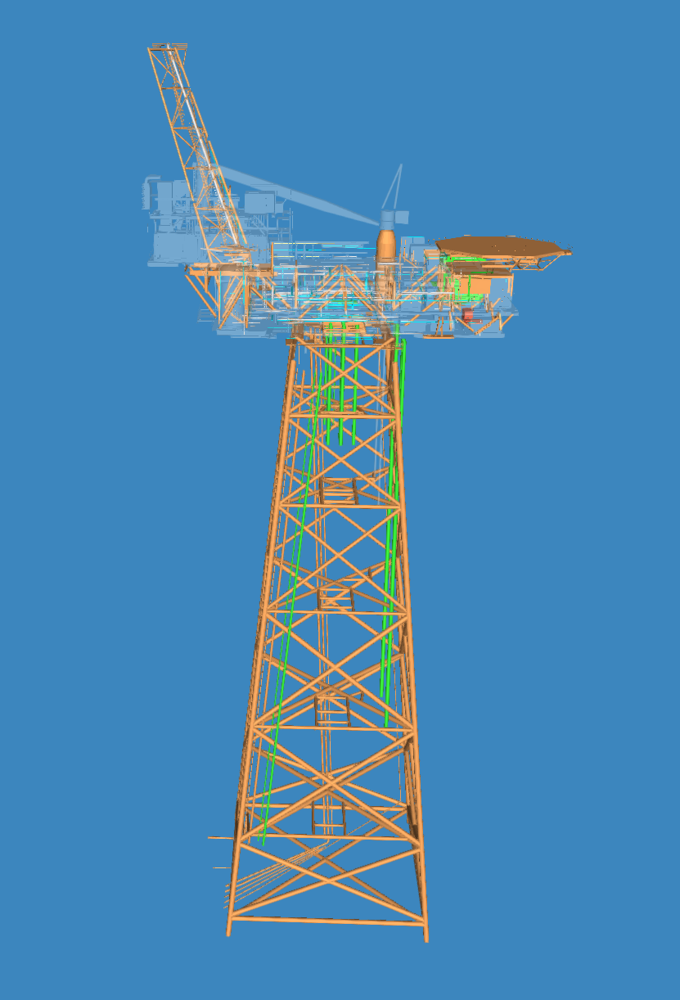

# Sector split on area

## [Reference branch](https://github.com/equinor/rvmsharp/tree/Spike/AreaOutlier)

## Goal

Following [Split On Area.](2023-11-22-SplitOnArea.md)

Try to handle parts of an area that are far away from the rest of the area, to see if area splitting is a possibility.

Some areas have outliers, that are not real outliers but still a part of the platform. This creates some really large, inaccurate sectors when splitting on area. By ignoring these a sector that follows the main body of the area can be made.

## Method

The method consists of a few steps:

- Add area as metadata on each node
- Group by area before splitting
- Create bounding boxes based on areas while ignoring outliers
- Place nodes in each best fitting bounding box
- Run splitting on each bounding box

Instead of directly splitting on the area nodes, a general bounding box is generated by the location of the main body of the area. This means that outlier area nodes can be put into another base for sector splitting than the rest of the area.

## Results

The result is a few large root sectors, because some areas span the whole platform.

For instance area HO on Huldra:

## Conclusion

Areas, with no manipulation or smart handling, are not suited for splitting. Isolated boxes that divided the platform would be optimal, but some areas cover the whole platform and some are tiny.

To use area splitting more logic is needed to create sensible sectors, if it even is possible.
