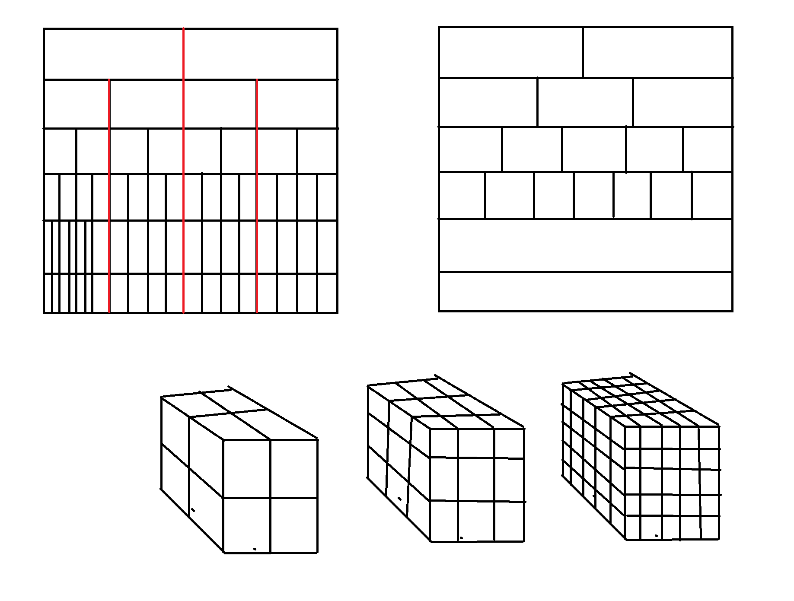
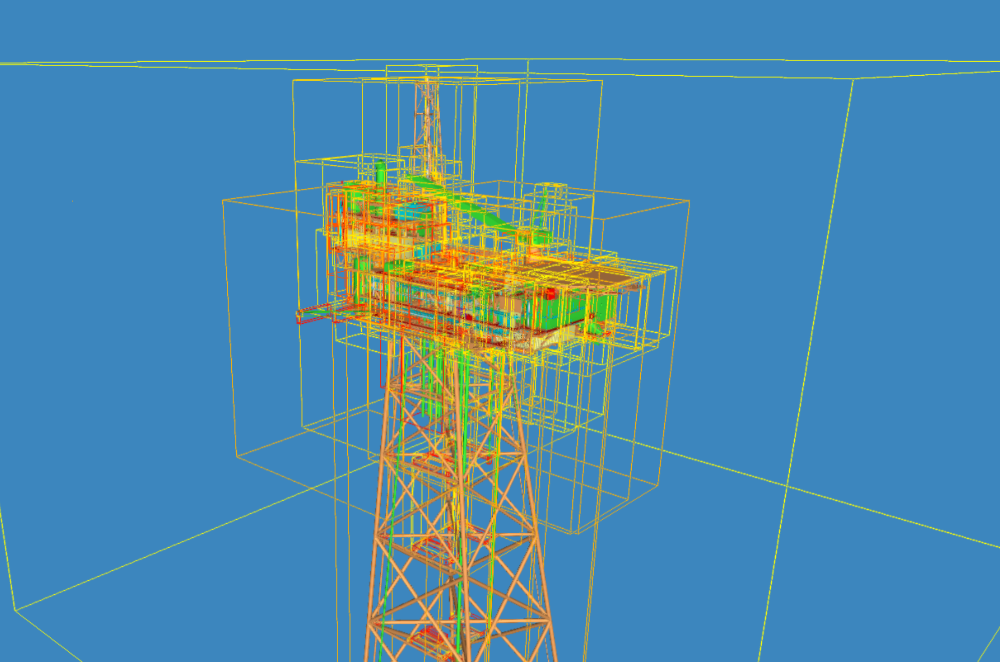

# Not Octree Splitting

## [Reference branch](https://github.com/equinor/rvmsharp/tree/Spike/NotOctree)

## Goal

By octree splitting one consequence is that at the center of the octree, for instance, there can be lot of sectors with aligned edges. This means that if the user is moving, he would suddenly move from one set of sectors into a whole new set of sectors. By not splitting in an octree fashion, but rather make depths of not aligned sectors, the aligment problem could be avoided. The positives about oct tree splitting would hopefully not be lost.

In the image below the octree splitting is represented as a binary tree, which is similar in functionality. The red lines represents some of the large edge aligning lines that will occur. In the not-octree splitting to the right there would be no red lines.

The drawback with this method is that we lose the parent/child tree structure. Every Sector would now be a child of root.

## Method

Each depth is split into a set of equal sized sectors. The dimensions are primes, with lower depths having more sectors, which avoids aligned sides.

- Depth 2 = 2 x 2 x 2
- Depth 3 = 3 x 3 x 3
- Depth 4 = 5 x 5 x 5
- Depth 5 = 7 x 7 x 7

The splitting is done recursively, where every node that is left after one depth is sent to the next depth. The whole flow looks like this:

1. Split into bounding boxes based on depth
2. Split nodes into each box from step 1
3. For each box:
   1. Get nodes by budget
   2. Create sector
   3. Note which nodes were added to the sector
4. Send the rest of the nodes to the next depth

## Results

The immediate impression from testing is that it feels the same as normal octree splitting.

Visually it looks like there are less edges aligning.

## Conclusion

The results are promising. It feels basically the same as the normal octree splitting. There are some theoretical advantages:

- If the user is moving she would get one sector at the time that needed to load, while in normal octree she would experience batches of sectors that needed loading
- The code is less complex
- Maybe it is easier to make the sectors less oblong, since the bounding boxes is created beforehand and are independent on the level above(?)

The downsides are:

- The tree structure is gone. No parent/child relationships.

## Next steps

- Try to tweak the splitting
- Make sectors less oblong
