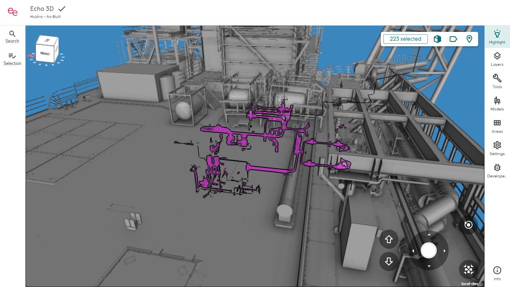

# Pictures with Playwright

## [Reference branch](https://github.com/equinor/Echo3DWeb/tree/vegst/spike/playwrightScreenshot)

## Goal

See if it is possible to take pictures using Playwright to use for EMHI (Echo Model Happiness Index) measurements. These pictures are meant for comparison with former "master"-pictures, to see if changes in the pipeline (RvmSharp) makes it better or worse. Using PlayWright we can easily achieve pictures taken at the same place with the same state.

This includes handling authentication and adding some highlighting.

## Method

Everything is done client side.

Playwright is already used in Echo3DWeb, so it is already set up for use. There are still some differences in our case.

### Authetication

We want to take pictures on different platforms, probably from the development enviroment, which means that we need to authenticate the user to be able to access the models.

**NOTE**: The current playwright tests run locally with a locally saved model, and intercepts network calls. Comment out the intercepting in the constructor of `Echo3dDevPage` to achieve this.

By running the Playwright test in headed mode, one can just log in manually and save the token afterwards. The resulting saved state contains the cookies which are needed for authentication.

1. Run the setup test in headed mode
2. Log in
3. When the test finishes an `user.json`file is made in `playwright/.auth/user.json`
   - The file name and location is arbitrary
4. Copy the cookies into the cookie list in `src/e2e/setup/stateChromium.json`-

**NOTE**: Be careful to not commit and push your cookies :O

### Taking picture

Taking pictures comes for free with playwright, you just have to reach the correct state before taking the picture. This is accomplished by saying what it should click on by using **locators**. The easiest is to just ask it to find some text and click on that, but if that is ambigious one can add a `data-testid` in the client code for it to find.

**NOTE**: Echo3dDevPage must be used to await the echo sepcific ready state of the model loading. The normal `await page` will not work.

The picture taken will be compared with the already saved master version. To get hold of the new picture either delete the old master, or save the temporary picture you will find in the `test-results` folder.

## Results

Example of picture of Huldra with a system higlighed (taken with PlayWright):

;

## Conclusion

This methods works if it is done locally, because the user has to be autenticated. Currently some manual labor is needed to handle saving the images to a suitable location.

This should work for a first version, but doing it automatically in a pipeline, or similar, requires another way of authenticating.

## Next steps

- Find a good way to save the pictures at a suitable location
- Find urls and what to higlight for a representative number of assets
- Automate picture taking
- Make sure the pictures are taken with the same graphic settings
