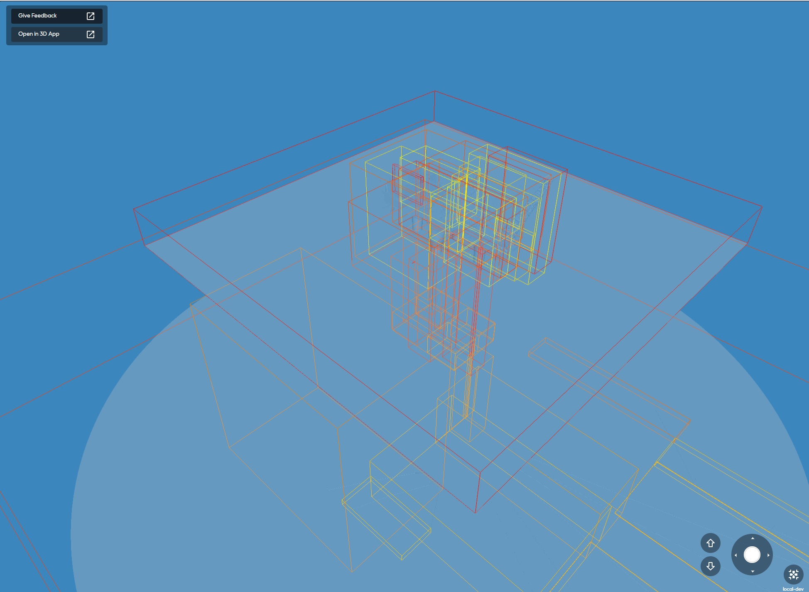

# Group nodes to make sectors less oblong

## [Reference branch](https://github.com/equinor/rvmsharp/tree/Spike/GroupNodesToReduceOblongity)

## Goal

Try to make sectors less oblong to achieve a better user experience. Group nodes so that the initial splitting point is a cube, instead of a large and flat rectangular box.

## Method

To avoid sectors being to oblong, the nodes are being grouped in cubes. If the bounding isn't "cubish" enough, the shortest side is used as a base to create cubes. The hope is that a more cubish base will create less oblong sectors.

For instance:

Bounding box lengths:
- X = 1
- Y = 2
- Z = 3

Will give six cubes 1 x 2 x 3. The nodes will then be placed based on center of node in the right cube.

## Evidence

The following screenshots are made at different depths, but at a point where the sectors are approximately equal in size. The difference in depths is just a result of the splitting being done differently.

Screenshot of TrollA before grouping:

Screenshot of TrollA after grouping:

Screenshot of Melkøya before grouping:

Screenshot of Melkøya after grouping:

## Conclusion

On Trolla it does not seem to make a noticeable difference, it might even look a bit worse. It is probably random of it becomes better or worse depending on how the splitting i done.
The difference is more noticeable on Melkøya, and is possibly an improvement.

## Next steps

- The sector count on Melkøya has increased from about 3000 to 4500, which should be a consideration if the spike is to be implemented.
- Find a robust way to check if the sectors will be too oblong.
- Maybe investigate handling obling sectors when they appear, instead of grouping beforehand?
